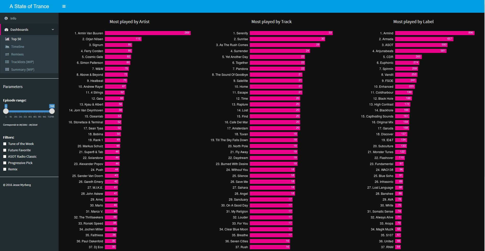

# A State of Trance Dashboards

A State of Trance (often abbreviated as ASOT) is a weekly radio show aired every Thursday at 20:00 (CET) and hosted by music producer and DJ Armin van Buuren. See the official ASOT radio show website [here](http://www.astateoftrance.com).

The purpose of ASOT Dashboards is to visualize episode tracklists through interactive dashboards. This repository contains the source code and data used for [A State of Trance Dashboards](https://asot.shinyapps.io/ASOT/).

## How the dashboards are created?

1. **Fetch tracklists from the official ASOT website** -- [get_data.py](src/get_data.py)

2. **Fetch tracklists manually for missing episodes** -- [1001tracklists](http://www.1001tracklists.com), [asot.djradiosets](http://asot.djradiosets.com), [Google](http://www.google.com), etc.

3. **Preprocess and extract features from the tracklists** -- [preprocess_data.py](src/preprocess_data.py)

4. **Visualize via interactive dashboards using [R / Shiny](http://shiny.rstudio.com)** -- [ui.R](src/ui.R), [server.R](src/server.R), [global.R](src/global.R), [plots.R](src/plots.R), [helpers.R](src/helpers.R)

5. (Optional) **Deploy your Shiny App on-line, for example by using [shinyapps.io](https://www.shinyapps.io/) ** -- Or test things locally first using [test.R](src/test.R)

---

#### Note: This is just a fun project and still a work in progress, and some data may be missing or inaccurate.

